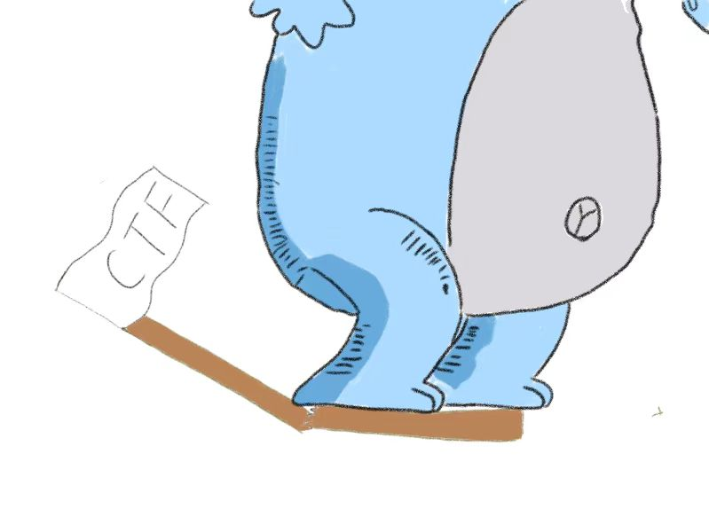

# CTF Challenge Benchmark



CTFChallenge Benchmark is a comprehensive evaluation suite designed to assess large language models (LLMs) in the domain of cybersecurity. The benchmark leverages high-quality, real-world CTF (Capture The Flag) challenges collected from past competitions across the internet, ensuring a rigorous and practical test of a model's security reasoning capabilities.

Unlike traditional objective scoring methods—which rely on exact answer matching and are prone to "answer surfing" (where models exploit memorization rather than demonstrate genuine understanding)—this benchmark employs a subjective scoring system. Evaluations are conducted by human experts who assess the reasoning process, methodology, and partial progress, minimizing the risk of models achieving high scores through rote memorization.

CTF problems are chosen as the foundation of this benchmark because they naturally reflect real cybersecurity tasks, such as reverse engineering, binary exploitation, cryptography, web security, and forensic analysis. This ensures that the evaluation goes beyond mere fact recall and instead tests a model’s ability to perform logical deduction, problem-solving, and technical creativity—key skills in practical security work.

By focusing on CTF challenges, CTFChallenge Benchmark provides a more objective, meaningful, and realistic assessment of a language model’s true cybersecurity proficiency.

## start

```shell
uv venv
source .venv/bin/activate
uv pip install .
```

then

```shell
ccb --base-url <base_url> --api-key <api_key> --model-name <model_name> --max-concurrent-requests 25
```

## Badges

[](https://choosealicense.com/licenses/mit/)

