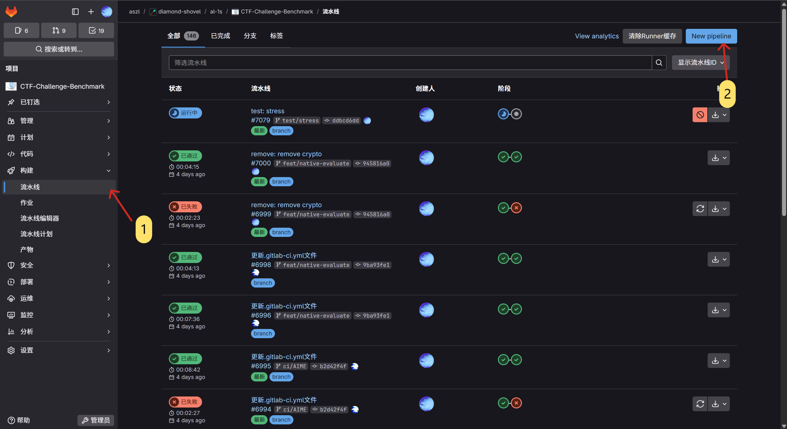
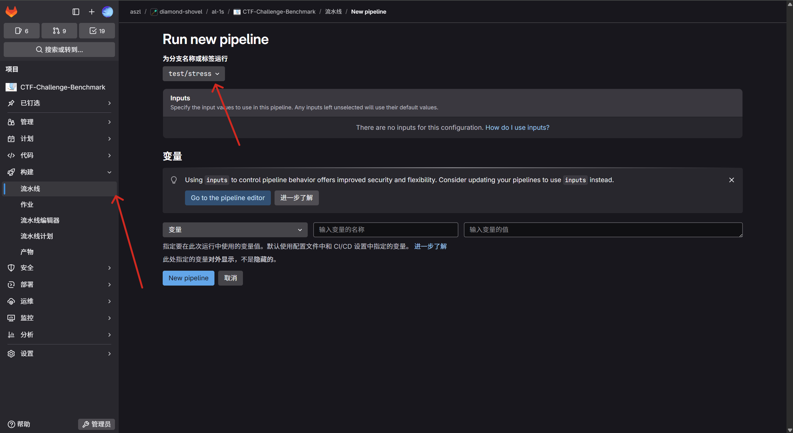
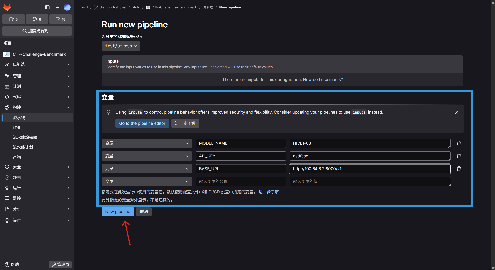

# CTF Challenge Benchmark - with Stress

**请勿合并到生产分支**

很明显，我偷懒了，我复用了CCB，来做一个压力测试，如果你想使用，你只需要这样使用

then

然后输入必要的环境变量，可用的环境变量表如下

|字段|描述|
|--|--|
|MODEL_NAME|模型名|
|API_KEY|ak|
|BASE_URL|base_url|

如:

